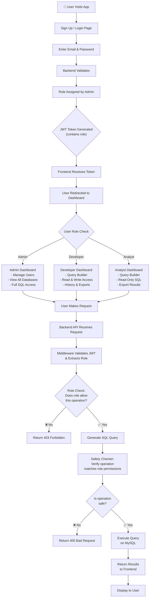

# Updated NL To SQL Query Builder

This project upgrades an existing Natural Language to SQL generation app to a full-fledged RBAC (Role-Based Access Control) application using FastAPI and React.

## Three Roles System

The system operates strictly under three defined roles with specific access levels to the generated database queries.

```
┌─────────────────────────────────────────────────────────────┐
│                    THREE ROLES SYSTEM                        │
├─────────────────────────────────────────────────────────────┤
│                                                              │
│  1️⃣ ADMIN                                                   │
│     ├─ Permissions: CREATE, ALTER, INSERT, UPDATE,         │
│     │               DELETE, SELECT, DROP                    │
│     ├─ Can: Manage users, assign roles, full DB access     │
│     └─ UI: Admin panel, user management, all features      │
│                                                              │
│  2️⃣ DEVELOPER                                               │
│     ├─ Permissions: INSERT, UPDATE, DELETE, SELECT         │
│     ├─ Can: Generate queries, execute both read & write    │
│     └─ UI: Query builder, execution history, exports       │
│                                                              │
│  3️⃣ ANALYST / USER (Read-Only)                              │
│     ├─ Permissions: SELECT only                             │
│     ├─ Can: View data, export results, saved queries       │
│     └─ UI: Query builder (SELECT only), view-only panels   │
│                                                              │
└─────────────────────────────────────────────────────────────┘
```

## System Architecture



## Database Schema (MySQL)

```sql
-- Users Table
CREATE TABLE users (
    id INT PRIMARY KEY AUTO_INCREMENT,
    email VARCHAR(255) UNIQUE NOT NULL,
    password_hash VARCHAR(255) NOT NULL,
    first_name VARCHAR(100),
    last_name VARCHAR(100),
    role_id INT NOT NULL,
    created_at TIMESTAMP DEFAULT CURRENT_TIMESTAMP,
    is_active BOOLEAN DEFAULT TRUE,
    FOREIGN KEY (role_id) REFERENCES roles(id)
);

-- Roles Table
CREATE TABLE roles (
    id INT PRIMARY KEY AUTO_INCREMENT,
    name VARCHAR(50) UNIQUE NOT NULL,  -- 'admin', 'developer', 'analyst'
    description VARCHAR(255)
);

-- Permissions Table
CREATE TABLE permissions (
    id INT PRIMARY KEY AUTO_INCREMENT,
    role_id INT NOT NULL,
    permission VARCHAR(50),  -- 'CREATE', 'INSERT', 'UPDATE', 'DELETE', 'SELECT', 'DROP', 'ALTER'
    FOREIGN KEY (role_id) REFERENCES roles(id)
);

-- Query History Table
CREATE TABLE query_history (
    id INT PRIMARY KEY AUTO_INCREMENT,
    user_id INT NOT NULL,
    query_text LONGTEXT,
    execution_time TIMESTAMP DEFAULT CURRENT_TIMESTAMP,
    status VARCHAR(20),  -- 'success', 'failed'
    result_rows INT,
    FOREIGN KEY (user_id) REFERENCES users(id)
);

-- Saved Queries Table
CREATE TABLE saved_queries (
    id INT PRIMARY KEY AUTO_INCREMENT,
    user_id INT NOT NULL,
    query_name VARCHAR(255),
    query_text LONGTEXT,
    created_at TIMESTAMP DEFAULT CURRENT_TIMESTAMP,
    FOREIGN KEY (user_id) REFERENCES users(id)
);
```

## Application Flow

1. **USER REGISTRATION**
   * Email + Password
   * Create user in DB (default role: analyst)
   * Admin assigns final role

2. **LOGIN**
   * Email + Password → Verify
   * Create JWT Token (payload: `{user_id, email, role}`)
   * Return token to frontend

3. **API REQUESTS**
   * Frontend sends token in Authorization header
   * Backend middleware validates token
   * Extract role from token
   * Check if role has permission for operation
   * Execute or deny request

4. **QUERY EXECUTION**
   * Role permission check (admin=all, dev=INSERT/UPDATE/DELETE/SELECT, analyst=SELECT only)
   * Safety checker validates query
   * Execute if safe
   * Log to query history

## Project Phases

- [x] **PHASE 1: PROJECT SETUP** - Directory structure, git, docs
- [x] **PHASE 2: BACKEND FOUNDATION** - FastAPI, config, DB, ORM
- [x] **PHASE 3: DATABASE & MODELS** - Schema models, initial data seed
- [x] **PHASE 4: AUTHENTICATION** - Registration, JWT, hashing, middleware
- [x] **PHASE 5: RBAC & PERMISSIONS** - Role checker, permission decorators
- [x] **PHASE 6: API ENDPOINTS** - Query gen, safety check, execution, history, user mgmt
- [x] **PHASE 7: FRONTEND** - React + Vite, API layer, Auth UI, Dashboard, Query Builder
- [x] **PHASE 8: INTEGRATION** - Connect frontend/backend, E2E tests, error handling
- [x] **PHASE 9: DEPLOYMENT** - Docker, CI/CD, deployment on Render/Railway
